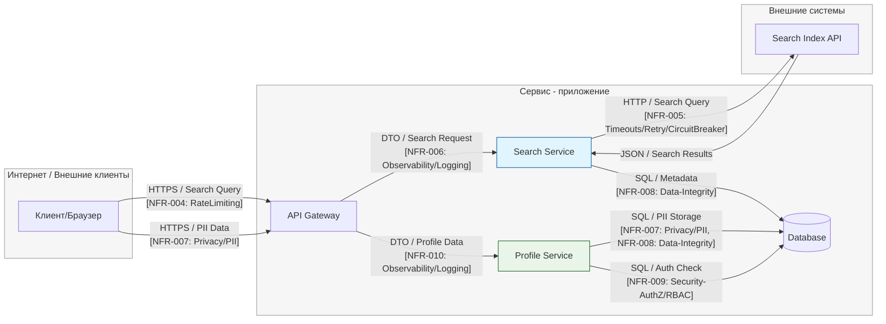

# TM - Требования безопасности + Модель угроз + ADR

## 0) Мета

- **Проект (опционально BYO):** учебный шаблон
- **Версия (commit/date):** 1.0.0 / 2025-10-11
- **Кратко (1-2 предложения):** Система предоставляет публичный API для пользователей и админов, хранит ПДн и токены; используется web/mobile клиентами.

---

## 1) Архитектура и границы доверия (TM1, S04)

- **Роли/активы:** пользователь, админ; ПДн, JWT-токены, платёжные данные
- **Зоны доверия:** Internet / DMZ / Internal / Device
- **Context/DFD:**

- **Критичные интерфейсы и допущения:**
  Internet — недоверенная зона; Gateway — публичный, проверка HTTPS/TTL; Admin — внутренняя зона; внешние интеграции через TLS; сервисы статeless; boundary между Internet и Internal через GW.

---

## 2) Реестр угроз STRIDE (TM2, TM3, S04)

| Risk ID | Source (DFD/Row) | Consolidated Description | Threat (S/T/R/I/D/E) | NFR link (ID) | L (1-5) | Rationale-L | I (1-5) | Rationale-I | **Score (=L×I)** | Decision (Top-5?) | ADR candidate |
| ------- | ---------------- | ------------------------ | -------------------- | ------------- | ------: | ----------- | ------: | ----------- | ---------------: | ----------------- | ------------- |
| **R-01** | Internet → API Gateway | Кража или повторное использование JWT-токена (replay/stolen token) из-за компрометации клиента или слабой проверки TTL. | **S** | need NFR (→ NFR-011) | 4 | Публичный интерфейс, частая цель атак; возможен фишинг или XSS. | 5 | Компрометация учётных записей и доступ к PII. | **20** | **Top-1** | `JWT TTL+Refresh` |
| **R-02** | Logs / Services / API | Утечка PII (email, phone, user_id) в логах или ошибках, особенно при исключениях. | **I** | **NFR-007** | 4 | Частая ошибка логирования, возможна даже при debug-уровне. | 4 | Нарушение GDPR/конфиденциальности, возможны санкции. | **16** | **Top-2** | `PII Masking` |
| **R-03** | API Gateway ↔ Services | Отсутствие или неправильная авторизация — доступ к чужим профилям (horizontal privilege escalation). | **E** | **NFR-009** | 3 | Сценарий возможен при ошибке в middleware. | 5 | Нарушение приватности, доступ к чужим данным. | **15** | **Top-3** | `RBAC isolation` |
| **R-04** | Services → DB | SQL-инъекции или некорректная валидация входных данных, приводящая к порче данных. | **T** | **NFR-008** | 3 | Средний риск при ошибках в ORM или ручных запросах. | 4 | Нарушение целостности БД, утечки данных. | **12** | **Top-4** | `Parametrized Queries + Validation` |
| **R-05** | API ↔ External Search API | Долгие или зависшие внешние запросы приводят к истощению потоков (DoS). | **D** | **NFR-005** | 3 | Внешние зависимости, нестабильный API. | 4 | Замедление работы сервиса, деградация поиска. | **12** | **Top-5** | `Circuit Breaker + Timeout` |
| **R-06** | API Gateway | Отсутствие трассировки корреляции запросов — невозможно расследовать инциденты. | **R** | **NFR-006**, **NFR-010** | 2 | Возможен при ошибках логирования. | 2 | Усложняет аудит, но не влияет напрямую на безопасность. | **4** | — | `Correlation-ID logging` |
| **R-07** | Database | Отсутствие аудита DML-операций (insert/update/delete). | **R** | need NFR (→ NFR-013) | 2 | Проблема организационного уровня. | 3 | Потеря трассируемости изменений. | **6** | — | `DB Audit Trail` |
| **R-08** | API Gateway | Перегрузка запросами без лимитов, вызывающая отказ в обслуживании. | **D** | **NFR-004** | 3 | Публичная поверхность, возможен спам/скриптинг. | 3 | Замедление отклика или временная недоступность. | **9** | — | `Rate Limiting` |
| **R-09** | External API Response | Ответ от внешнего API содержит неожиданные данные или PII. | **I** | need NFR (→ NFR-012) | 2 | Реже встречается, но возможен при слабой валидации схем. | 3 | Потенциальная утечка чужих данных. | **6** | — | `External Response Sanitization` |
| **R-10** | Search Service / Load | Высокая нагрузка на индекс замедляет SLA. | **D** | **NFR-003** | 3 | Вероятно при пиках нагрузки. | 2 | Влияет на UX, но не на безопасность. | **6** | — | `Autoscaling + SLO monitor` |

---

## 3) Приоритизация и Top-5 _(TM3, S04)_

| Rank | Risk ID | Risk Summary | L | I | **L×I** | ADR candidate | Why critical |
|------|----------|---------------|---|---|---------|----------------|---------------|
| **Top-1** | R-01 | Кража/повторное использование JWT-токена | **4** | **5** | **20** | `JWT TTL+Refresh` | Высокая вероятность из-за публичного API и частых атак на токены; ущерб критичный — полный доступ к учётке и PII. |
| **Top-2** | R-02 | Утечка PII в логах/ошибках | **4** | **4** | **16** | `PII Masking` | Частая ошибка при логировании; значительный ущерб (нарушение конфиденциальности, GDPR). |
| **Top-3** | R-03 | Ошибки в авторизации (RBAC) | **3** | **5** | **15** | `RBAC isolation` | Средняя вероятность при ошибках middleware; ущерб максимальный — доступ к чужим данным. |
| **Top-4** | R-04 | SQL-инъекция/ошибки валидации | **3** | **4** | **12** | `Parametrized Queries + Validation` | Реже при использовании ORM, но последствия серьёзные — компрометация или порча данных. |
| **Top-5** | R-05 | Перегрузка/зависание внешнего API | **3** | **4** | **12** | `Circuit Breaker + Timeout` | Возможна при сбое внешнего провайдера; высокий ущерб — деградация сервиса, DoS. |

---

## 4) Требования (S03) и ADR-решения (S05) под Top-5 (TM4)

### NFR-1. Аутентификация и защита токенов

- **AC (GWT):**
  - **Given** валидный токен, **When** запрос `/api/...`, **Then** `200` и `X-User-Id=subject`.
  - **Given** просроченный/поддельный токен, **When** запрос, **Then** `401` и событие `auth.token_invalid` в аудите.

### NFR-2. Лимиты и таймауты

- **AC (GWT):** rate-limit ≤ **N** rps/uid и ≤ **M** rps/ip; timeout ≤ **T** сек; при превышении - `429` + событие `rate_limit_hit`.

### NFR-3. Аудит критических операций

- **AC (GWT):** логируется `correlation_id`, uid, время и результат для операций (`login`, `role_change`, `data_export`, …).

> TODO: при необходимости добавьте свои NFR под Top-5.

---

### Краткие ADR (минимум 2) - архитектурные решения S05

(карточки короткие, по делу)

#### ADR-001 - TODO: название

- **Context (угрозы/NFR):** T01, NFR-1; контур AUTH
- **Decision:** что делаем и где (напр., проверка подписи токена в GW; короткий TTL; rotatable keys)
- **Trade-offs (кратко):** стоимость/производительность/UX
- **DoD (готовность):** измеримые условия (см. раздел 6)
- **Owner:** ФИО/роль
- **Evidence (план/факт):** EVIDENCE/dast-auth-YYYY-MM-DD.pdf#token-tests

#### ADR-002 - TODO: название

- **Context:** T05, NFR-2; публичные endpoint’ы
- **Decision:** rate-limit на GW + server-side timeouts; backpressure
- **Trade-offs:** возможные 429 и влияние на UX
- **DoD:** срабатывание 429 при >N rps; p95 ≤ T сек
- **Owner:** ФИО/роль
- **Evidence (план/факт):** EVIDENCE/load-after.png

---

## 5) Трассировка Threat → NFR → ADR → (План)Проверки (TM5)

| Threat | NFR   | ADR     | Чем проверяем (план/факт)                                                                 |
|-------:|-------|---------|-------------------------------------------------------------------------------------------|
| T01    | NFR-1 | ADR-001 | DAST auth-flow; аудит `auth.token_invalid` → EVIDENCE/dast-auth-YYYY-MM-DD.pdf / audit-sample.txt |
| T05    | NFR-2 | ADR-002 | Нагрузочный тест + проверка 429/таймаутов → EVIDENCE/load-after.png                       |
| T04    | NFR-X | ADR-00X | SAST/линтер на инъекции/параметризацию → EVIDENCE/sast-YYYY-MM-DD.pdf#sql-1              |
| T03    | NFR-3 | ADR-00Y | Анализ образцов аудита → EVIDENCE/audit-sample.txt#corrid                                |

> TODO: заполните таблицу для ваших Top-5; верификация может быть «планом», позже артефакты появятся в DV/DS.

---

## 6) План проверок (мост в DV/DS)

- **SAST/Secrets/SCA:** TODO: инструменты и куда положите отчёты в `EVIDENCE/`
- **SBOM:** TODO: генератор/формат
- **DAST (если применимо):** TODO: стенд/URL; профиль
- **Примечание:** на этапе TM допустимы черновые планы/ссылки; финальные отчёты появятся в **DV/DS**.

---

## 7) Самопроверка по рубрике TM (0/1/2)

- **TM1. Архитектура и границы доверия:** [ ] 0 [ ] 1 [ ] 2  
- **TM2. Покрытие STRIDE и уместность угроз:** [ ] 0 [ ] 1 [ ] 2  
- **TM3. Приоритизация и Top-5:** [ ] 0 [ ] 1 [ ] 2  
- **TM4. NFR + ADR под Top-5:** [ ] 0 [ ] 1 [ ] 2  
- **TM5. Трассировка → (план)проверок:** [ ] 0 [ ] 1 [ ] 2  

**Итог TM (сумма):** __/10
