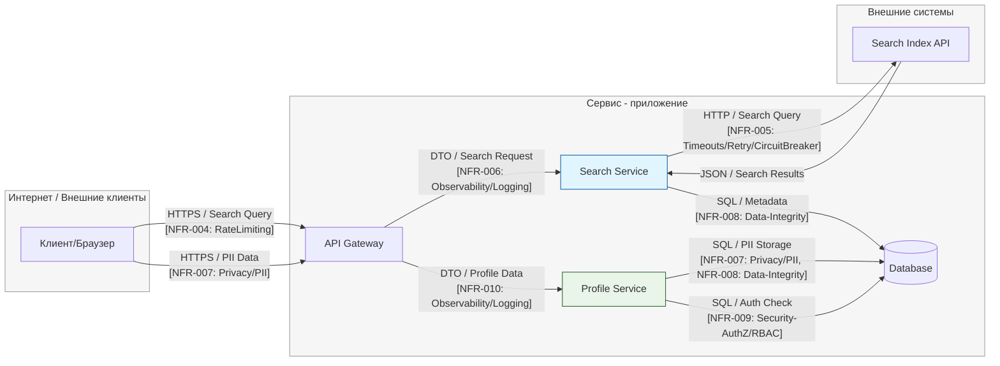

# TM - Требования безопасности + Модель угроз + ADR

## 0) Мета

- **Проект (опционально BYO):** учебный шаблон
- **Версия (commit/date):** 1.0.0 / 2025-10-11
- **Кратко (1-2 предложения):** Система предоставляет публичный API для пользователей и админов, хранит ПДн и токены; используется web/mobile клиентами.

---

## 1) Архитектура и границы доверия (TM1, S04)

- **Роли:** пользователь (выполняет поисковые запросы и управляет профилем), админ (имеет доступ к панели мониторинга и управлению профилями (через внутренний интерфейс))
- **Активы:** персональные данные (PII) — информация профиля пользователя (ФИО, e-mail, департамент, интересы); токены аутентификации (JWT) используются для верификации запросов и разграничения доступа; результаты поиска — агрегированные данные из внешних источников (Search Index API); метаданные пользователей и публикаций — хранятся в БД; логи и трассировка — данные об активности, для аудита и диагностики
- **Зоны доверия:** Internet, Service (Internal - основные сервисы приложения: API Gateway, Search Service, Profile Service, Database), External Systems (интеграция с внешним Search Index API), Admin / Monitoring Zone (доступ к административной панели и логам)
- **Context/DFD:**

**Критичные интерфейсы и допущения:**
- Доверенные компоненты:
  - API Gateway, Search Service, Profile Service и Database — размещены в одной внутренней защищённой сети.
  - Коммуникации между внутренними сервисами проходят по защищённому каналу (TLS, mTLS).
  - Авторизация реализована через внутренний RBAC (NFR-009).

- Недоверенные компоненты:
  - Клиентский браузер и внешние интеграции (Search Index API).
  - Все входящие запросы из Internet требуют валидации токена и проверки лимитов.

- Внешние интеграции:
  - Search Service → Search Index API — ограниченный канал к внешней системе, с политикой retry/timeout/circuit breaker (NFR-005).
  - Все ответы валидируются схемой JSON и журналируются.

- Админ-доступ:
  - Разрешён только из внутренней сети через VPN и MFA.
  - Используются отдельные роли и ключи доступа, операции логируются (NFR-010).

- Граница доверия (Trust Boundary):
  - Проходит между Internet и Service, на уровне API Gateway.
  - Вторая граница — между Service и External Systems, где требуется дополнительная проверка TLS-сертификатов и контроль ошибок.

---

## 2) Реестр угроз STRIDE (TM2, TM3, S04)

| Risk ID | Source (DFD/Row) | Consolidated Description | Threat (S/T/R/I/D/E) | NFR link (ID) | L (1-5) | Rationale-L | I (1-5) | Rationale-I | **Score (=L×I)** | Decision (Top-5?) | ADR candidate |
| ------- | ---------------- | ------------------------ | -------------------- | ------------- | ------: | ----------- | ------: | ----------- | ---------------: | ----------------- | ------------- |
| **R-01** | Internet → API Gateway | Кража или повторное использование JWT-токена (replay/stolen token) из-за компрометации клиента или слабой проверки TTL. | **S** | need NFR | 4 | Публичный интерфейс, частая цель атак; возможен фишинг или XSS. | 5 | Компрометация учётных записей и доступ к PII. | **20** | **Top-1** | `JWT TTL+Refresh` |
| **R-02** | Logs / Services / API | Утечка PII (email, phone, user_id) в логах или ошибках, особенно при исключениях. | **I** | **NFR-007** | 4 | Частая ошибка логирования, возможна даже при debug-уровне. | 4 | Нарушение GDPR/конфиденциальности, возможны санкции. | **16** | **Top-2** | `PII Masking` |
| **R-03** | API Gateway ↔ Services | Отсутствие или неправильная авторизация — доступ к чужим профилям (horizontal privilege escalation). | **E** | **NFR-009** | 3 | Сценарий возможен при ошибке в middleware. | 5 | Нарушение приватности, доступ к чужим данным. | **15** | **Top-3** | `RBAC isolation` |
| **R-04** | Services → DB | SQL-инъекции или некорректная валидация входных данных, приводящая к порче данных. | **T** | **NFR-008** | 3 | Средний риск при ошибках в ORM или ручных запросах. | 4 | Нарушение целостности БД, утечки данных. | **12** | **Top-4** | `Parametrized Queries + Validation` |
| **R-05** | API ↔ External Search API | Долгие или зависшие внешние запросы приводят к истощению потоков (DoS). | **D** | **NFR-005** | 3 | Внешние зависимости, нестабильный API. | 4 | Замедление работы сервиса, деградация поиска. | **12** | **Top-5** | `Circuit Breaker + Timeout` |
| **R-06** | API Gateway | Отсутствие трассировки корреляции запросов — невозможно расследовать инциденты. | **R** | **NFR-006**, **NFR-010** | 2 | Возможен при ошибках логирования. | 2 | Усложняет аудит, но не влияет напрямую на безопасность. | **4** | — | `Correlation-ID logging` |
| **R-07** | Database | Отсутствие аудита DML-операций (insert/update/delete). | **R** | need NFR | 2 | Проблема организационного уровня. | 3 | Потеря трассируемости изменений. | **6** | — | `DB Audit Trail` |
| **R-08** | API Gateway | Перегрузка запросами без лимитов, вызывающая отказ в обслуживании. | **D** | **NFR-004** | 3 | Публичная поверхность, возможен спам/скриптинг. | 3 | Замедление отклика или временная недоступность. | **9** | — | `Rate Limiting` |
| **R-09** | External API Response | Ответ от внешнего API содержит неожиданные данные или PII. | **I** | need NFR | 2 | Реже встречается, но возможен при слабой валидации схем. | 3 | Потенциальная утечка чужих данных. | **6** | — | `External Response Sanitization` |
| **R-10** | Search Service / Load | Высокая нагрузка на индекс замедляет SLA. | **D** | **NFR-003** | 3 | Вероятно при пиках нагрузки. | 2 | Влияет на UX, но не на безопасность. | **6** | — | `Autoscaling + SLO monitor` |

---

## 3) Приоритизация и Top-5 _(TM3, S04)_

| Rank | Risk ID | Risk Summary | L | I | **L×I** | ADR candidate | Why critical |
|------|----------|---------------|---|---|---------|----------------|---------------|
| **Top-1** | R-01 | Кража/повторное использование JWT-токена | **4** | **5** | **20** | `JWT TTL+Refresh` | Высокая вероятность из-за публичного API и частых атак на токены; ущерб критичный — полный доступ к учётке и PII. |
| **Top-2** | R-02 | Утечка PII в логах/ошибках | **4** | **4** | **16** | `PII Masking` | Частая ошибка при логировании; значительный ущерб (нарушение конфиденциальности, GDPR). |
| **Top-3** | R-03 | Ошибки в авторизации (RBAC) | **3** | **5** | **15** | `RBAC isolation` | Средняя вероятность при ошибках middleware; ущерб максимальный — доступ к чужим данным. |
| **Top-4** | R-04 | SQL-инъекция/ошибки валидации | **3** | **4** | **12** | `Parametrized Queries + Validation` | Реже при использовании ORM, но последствия серьёзные — компрометация или порча данных. |
| **Top-5** | R-05 | Перегрузка/зависание внешнего API | **3** | **4** | **12** | `Circuit Breaker + Timeout` | Возможна при сбое внешнего провайдера; высокий ущерб — деградация сервиса, DoS. |

---

## 4) Требования (S03) и ADR-решения (S05) под Top-5 (TM4)

| ID | Risk | User Story / Feature | Category | Requirement (NFR) | Rationale / Risk | Acceptance (G-W-T) | Evidence (test/log/scan/policy) | Trace (issue/link) | Owner | Status | Priority    | Severity   | Tags |
| -- | ---- | -------------------- | -------- | ----------------- | ---------------- | ------------------ | ------------------------------- | ------------------ | ----- | ------ | ----------- | ---------- | ---- |
| NFR-005 | R-05 (Top-5) | As a user I want to search by field/tags to find relevant results | Timeouts/Retry/CircuitBreaker | Outbound calls to Search Index API: timeout ≤ 2s, retry ≤ 3 with jitter; circuit-breaker on errors ≥50% over 1 min | Ensuring resilience to temporary unavailability or degradation of search index. Protection from cascading failures. Risk: request hanging and resource exhaustion | **Given** Search Index API unavailable or responding with delay >2s **When** service calls it to process GET /api/search **Then** total wait ≤ 8s; no more than 3 retry attempts with jitter; circuit breaker activates after 50% error threshold over 1 min | HTTP client config; resilience test; circuit breaker logs | #127 | team-backend | Draft | P2 - Medium | S2 - Major | resilience,timeout,retry,circuit-breaker |
| NFR-007 | R-02 (Top-2) | As a user I want to edit profile to maintain current data | Privacy/PII | PII fields (email, phone) masked in logs; raw PII data in DB deleted/anonymized after 90 days of account deactivation | Privacy compliance (GDPR, CCPA) and reducing confidential data leakage risk through system logs | **Given** DTO with email user@example.com **When** this object is logged **Then** PII fields masked; retention plan exists and applied within 90 days | PII masking test; retention policy documentation | #129 | team-backend, team-security | Draft | P1 - High | S2 - Major | privacy,pii,compliance,gdpr |
| NFR-008 | R-04 (Top-4) | As a user I want to edit profile to maintain current data | Data-Integrity | All SQL queries use parameterized queries; string fields normalized to NFC, phones to E.164, dates to UTC | SQL injection protection and data integrity assurance. Eliminating ambiguities in comparison and search | **Given** input data: name="Café", phone="8 (900) 123-45-67" **When** PUT /api/profile executed **Then** DB stores normalized values and uses parameterized statements | Code review; canonicalization tests; ORM/validator settings | #130 | team-backend | Draft | P1 - High | S2 - Major | security,sql-injection,canonicalization,data-quality |
| NFR-009 | R-03 (Top-3) | As a user I want to edit profile to maintain current data | Security-AuthZ/RBAC | User can read and modify only own profile. Access strictly by user_id from authenticated session | Least privilege principle and user-level data isolation. Risk: horizontal privilege escalation | **Given** user with ID=123 **When** tries to access GET /api/profile/456 **Then** returns 404 Not Found | Isolation integration test; authorization middleware code | #131 | team-backend | Draft | P1 - High | S1 - Critical | security,authorization,rbac,data-isolation |

---

### Краткие ADR (минимум 2) - архитектурные решения S05

#### ADR-001 - JWT TTL + Refresh + Rotation

- **Context (угрозы/NFR):**  
  - T01 — Token reuse / stolen JWT on public edge (R-01, Score=20); NFR-011; контур AUTH.
  - DFD: Edge Internet → API (JWT).
  - Assumptions: single gateway, stateless services, HTTPS-only.  
- **Decision:** Внедрить политику короткоживущих JWT (TTL=15 мин) с refresh (TTL=30 дней) и ротацией ключей через JWKS (`kid` включён). Logout/blacklist по событию. 
- **Trade-offs (кратко):** 
  + Минимизация окна атаки при краже токена.  
  − Усложнение управления refresh-токенами, чувствительность к clock skew. 
- **DoD (готовность):**
  - При истекшем токене → `401` (RFC7807).  
  - При валидном refresh → новый токен с обновлённым `exp`.  
  - `correlation_id` в логах, без PII.  
  - Unit+integration тесты пройдены; не найдено JWT в репозитории.  
- **Owner:** Team-A / Security Lead.
- **Evidence (план/факт):** `EVIDENCE/dast-auth-2025-10-11.pdf#token-tests`  

#### ADR-002 - PII Masking + Data Retention  

- **Context:**
  - Risk: R-02 “PII exposure in logs” (L=4, I=4, Score=16)  
  - DFD: Node Service → Logs (Profile Service, Search Service)  
  - NFR: NFR-007  
  - Assumptions: structured JSON logging; все PII поля определены; политика хранения ≤90 дней; соответствие GDPR/CCPA.  
- **Decision:** Внедрить middleware для маскировки PII в логах и настройку политики хранения для raw PII. Цель — предотвратить утечку конфиденциальных данных и обеспечить соответствие требованиям приватности.  
- **Trade-offs:**
  + Снижение риска утечек и соответствие GDPR/CCPA  
  − Меньше деталей для отладки; дополнительная нагрузка на логирование  
- **DoD:**
  - DTO с PII логируется → поля маскированы/удалены  
  - Retention policy применена  
  - JSON логи содержат `correlation_id`, без raw PII  
  - Unit+integration тесты пройдены; SLO: ≤90 дней хранения, 0 утечек 
- **Owner:** Team-Backend / Security Engineer
- **Evidence (план/факт):** `EVIDENCE/logs-privacy-2025-10-11.pdf#pii-mask-tests`  

---

## 5) Трассировка Threat → NFR → ADR → (План)Проверки (TM5)

| Threat | Risk | NFR   | ADR     | Чем проверяем (план/факт)                                                                 |
|-------:|-------|-------|---------|-------------------------------------------------------------------------------------------|
| T01    | R-01 | Need NFR | ADR-001 — *JWT TTL + Refresh + Rotation* | DAST auth-flow; аудит `auth.token_invalid` → EVIDENCE/dast-auth-YYYY-MM-DD.pdf / audit-sample.txt |
| T02    | R-02 | NFR-007 | ADR-002 — *PII Masking + Data Retention* | Unit+integration тесты на маскирование, e2e лог-валидация → `EVIDENCE/logs-privacy-2025-10-11.pdf#pii-mask-tests`                       |
| T03    | R-03 | NFR-009 | ADR-00X — *RBAC Isolation* | Анализ образцов аудита доступа и ролей → `EVIDENCE/audit-sample.txt#rbac-checks`              |
| T04    | R-04 | NFR-008 | ADR-00Y — *Parametrized Queries + Validation* | SAST/линтер на инъекции и параметризацию → `EVIDENCE/sast-2025-10-11.pdf#sql-1`                                |
| T05    | R-05 | NFR-005 | ADR-00Z — *Circuit Breaker + Timeout* | Нагрузочный тест + проверка 429/таймаутов → `EVIDENCE/load-after.png`                                |

---

## 6) План проверок (мост в DV/DS)

- **SAST / Secrets / SCA:**  
  Инструменты: `GitHub Advanced Security (CodeQL)`, `Trivy`, `gitleaks`.  
  Цель — статический анализ уязвимостей, поиск секретов и зависимостей с CVE.  
  Отчёты: сохраняются в `EVIDENCE/sast-2025-10-11.pdf`, `EVIDENCE/secrets-scan.txt`, `EVIDENCE/sca-report.json`.

- **SBOM:**  
  Генератор: `Syft` (Anchore).  
  Формат: `CycloneDX JSON`.  
  Отчёт: `EVIDENCE/sbom-cyclonedx.json`.

- **DAST (если применимо):**  
  Инструмент: `OWASP ZAP` в headless-режиме.  
  Профиль: `auth-flow + search endpoints`, включая сценарии `/api/auth`, `/api/profile`, `/api/search`.  
  Отчёт: `EVIDENCE/dast-auth-2025-10-11.pdf`.

- **Примечание:**  
  На этапе **Threat Modeling (TM)** допустимы черновые планы и ссылки.  
  Финальные отчёты, результаты сканирований и артефакты проверок будут добавлены на этапах **DV (Design Validation)** и **DS (Design Sign-off)**.

---

## 7) Самопроверка по рубрике TM (0/1/2)

- **TM1. Архитектура и границы доверия:** [ ] 0 [ ] 1 [+] 2  
- **TM2. Покрытие STRIDE и уместность угроз:** [ ] 0 [ ] 1 [+] 2  
- **TM3. Приоритизация и Top-5:** [ ] 0 [ ] 1 [+] 2  
- **TM4. NFR + ADR под Top-5:** [ ] 0 [ ] 1 [+] 2  
- **TM5. Трассировка → (план)проверок:** [ ] 0 [ ] 1 [+] 2  

**Итог TM (сумма):** 10/10
