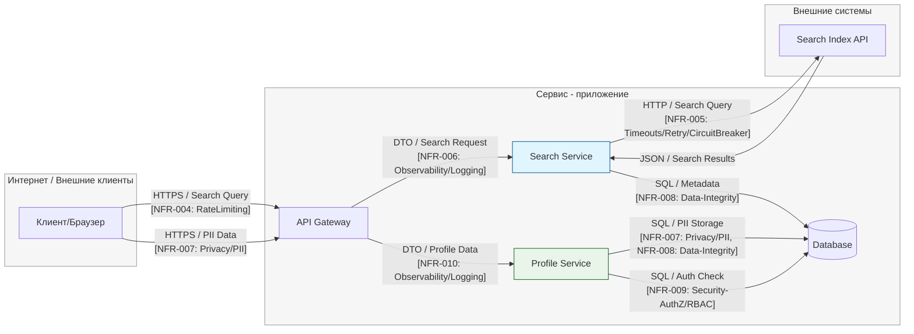

# S04 - DFD

**Задача:** за 15-20 минут построить **понятную DFD** уровня сервиса (3-5 узлов) с явными **границами доверия** и подписями ключевых **потоков данных**. Эту DFD вы далее используете в `S04_stride_matrix_template.md` для STRIDE per element и приоритизации **L×I (1-5)**.

---

## Правила минимальной DFD

* **3-5 узлов** максимум: *Клиент/Front*, *API/Controller*, *Service/Бизнес-логика*, *DB/Хранилище*, *(опционально)* *External API/Queue*.
* Явно отметьте **trust boundaries** (Интернет ↔ Сервис, Сервис ↔ Внешние системы, Сервис ↔ Хранилище).
* На **рёбрах** подпишите **типы данных**: `JWT`, `PII`, `file`, `payment`, `DTO`, `SQL`, `event`, …
* Не уходим в микросервисы и детали реализации - уровень **контур/сервис**.
* Сразу держите связь с S03: около потока/узла можно указать **`[NFR: …]`** (ID из реестра S03).

---

## Базовый каркас (mermaid)

> Замените названия узлов под свой контекст, добавьте/уберите узлы, подпишите типы данных на рёбрах.
> **Важно:** границы доверия оформлены как `subgraph` с единым стилем.

---

## Как адаптировать под свой кейс

1. **Переименуйте узлы** (например, `A` → `Public API`, `S` → `Orders Service`, `D` → `PostgreSQL`).
2. **Добавьте/уберите** блоки: если нет внешних интеграций - удалите `External`; если есть очередь - раскомментируйте `Q`.
3. **Подпишите рёбра**: укажите **тип данных** (*JWT/PII/file/payment/DTO/SQL*) и ключевые **контроли из S03**:

   * Пример: `-- "PII [NFR: Privacy/PII, RFC7807]" -->`
   * Пример: `-- "file [NFR: InputValidation, Limits]" -->`
4. **Проверьте границы доверия**: всё, что «снаружи», должно явно пересекать границу *Internet → Service*; любые внешние интеграции - *Service → External*.

---

## Быстрые подсказки по подписанию потоков

* **Аутентификация:** `JWT/HTTPS`, [NFR: `Security-AuthN`, `RateLimiting`].
* **Авторизация/тенант:** упоминание tenant-id на внутренних ребрах, [NFR: `Security-AuthZ/RBAC`].
* **Валидация ввода/размер:** на публичных ребрах отметьте [NFR: `InputValidation`, `Limits`].
* **Ошибки/контракт:** для ответов от API добавьте [NFR: `API-Contract/Errors (RFC7807)`].
* **Приватность:** любые `PII` помечайте и связывайте с [NFR: `Privacy/PII`].
* **Наблюдаемость/аудит:** укажите `correlation_id` и audit-events на критичных переходах, [NFR: `Observability/Logging`, `Auditability`].
* **Timeout/Retry/CircuitBreaker:** на внешних вызовах, [NFR: соответствующие].

---

## Как это использовать дальше

* Перейдите к `S04_stride_matrix_template.md` и пройдите **STRIDE per element** (для каждого **узла и ребра**).
* У каждой угрозы укажите **NFR-ID** (связь с S03) и оцените **L×I (1-5)**; посчитайте `Score = L×I`.
* Выделите **топ-5** рисков - они уйдут в ADR (S05).

---

## Самопроверка (быстро)

* [+] **3-5 узлов**, не больше.
* [+] Границы доверия видимы и логичны.
* [+] На рёбрах есть **типы данных** и пометки `[NFR: …]`.
* [+] Ясно, где появляются `PII`, `JWT`, `file`, `payment`.
* [+] Понятно, какие элементы/потоки пойдут в STRIDE и L×I (1-5).

---
